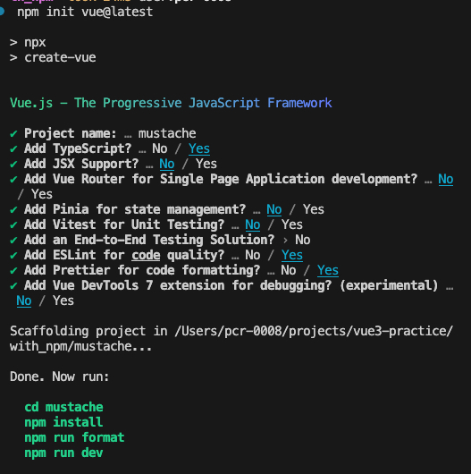

# 備忘録

## プロジェクト作成、動作確認 -21

### プロジェクト作成

#### 作成のためのコマンド

```bash
npm init vue@latest;
```

##### 表示されるコマンドの選択と動作確認までののコマンド

```bash
```



### 動作確認

`npm run dev`を実行した後に`localhost:5173`にアクセス
して表示されればok

## Vueの基本 -29

### コンポーネント、基本構文

#### ref

テンプレートに表示させる変数を定義する。  
教材内ではテンプレート変数と呼ぶ。  
<!-- スクリプトブロックで定義した変数名でテンプレートブロックで利用できるようにする -->

```js
const name = ref("田中太郎");
```

### モジュール -34

#### モジュール

モダンJavaScriptでは、関数やクラス、オブジェクトなどを、それぞれ別ファイルに記述し、それを読み込んで利用できる仕組みがあります。  
これをモジュールといいます。  
モジュールを外部から利用できるようにするには、あらかじめ、それらの関数やクラスが外部から利用できることをコードに記述しておく必要があります。  
これをエクスポートといい、例えば、次のように、関数定義やクラス定義の前にexportキーワードで指定します。

#### エクスポート

エクスポートにはバリエーションがあります。defaultキーワードを付記したものです。  
これをデフォルトエクスポートといい、モジュールファイルにひとつだけ定義できます。
デフォルトエクスポートは、いわば「名無し」としてエクスポートされるので、インポートの際に、こちらで名前をつける必要があります。  
ポイントは、importの次に{ }がないところです。  
デフォルトエクスポートは、いわば「名無し」としてエクスポートされるので、インポートの際に、こちらで名前をつける必要があります。

### リアクティブシステム -35

#### リアクティブ

変数の値の変化に連動して表示内容が自動で変化すること。  
`ref()`と`reactive()` には一長一短がある。  
指針としては、基本的には`ref()`をする。  
どうしてもオブジェクトをまとめてリアクティブデータとする必要がある場合には、reactive()を利用する

##### ref()

##### reactive()関数

複数のデータをひとつのオブジェクトとして扱い、それらをまとめてリアクティブにする関数

## Vueのスタイルガイド

[Style Guide | Vue.js](https://vuejs.org/style-guide/)

守らなければならない優先順位が定められている

1. 必ず守らなければならないAルール（Essential）
1. 極力守るべきBルール（Strongly Recommended）
1. 基本的に守るべきCルール（Recommended）
1. 注意していれば守らなくてもよいDルール（Use with Caution）

> [Priority B Rules: Strongly Recommended | Vue.js](https://vuejs.org/style-guide/rules-strongly-recommended.html#simple-expressions-in-%E3%81%AA%E3%81%8A%E3%80%81%E3%81%93%E3%81%AE%E3%82%B9%E3%82%BF%E3%82%A4%E3%83%AB%E3%82%AC%E3%82%A4%E3%83%89%E3%81%AF%E3%80%81%E6%9C%AC%E6%9B%B8%E4%B8%AD%E3%81%A7%E3%82%82%E5%BF%85%E8%A6%81%E3%81%AB%E5%BF%9C%E3%81%98%E3%81%A6%E7%B4%B9%E4%BB%8B%E3%81%97%E3%81%A6%E3%81%84%E3%81%8D%E3%81%BE%E3%81%99%E3%80%82)

### マスタッシュ構文内に式を書くのは極力避ける

## Vueプロジェクトの構成と動作原理 -43

### Vueプロジェクトのファイル構成

### distフォルダ

デプロイ用ファイル一式が格納されている

### publicフォルダとindex.html

### Vueプロジェクトの動作原理 -46

### Vueプロジェクト内ファイルのコードスタイル -47

- 文字列がシングルクォーテーションで囲まれている
- 文末のセミコロンがない

